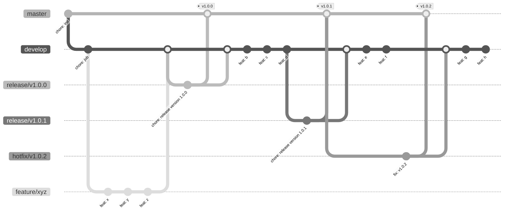

# Nggql — GAAND stack

Nggql is a simple imaginary web application for software houses build with __GAAND__(GraphQL, Angular, Apollo and Neo4j Database) stack.

## Development server

1. `docker-compose up -d`
2. `npm start`

### Api rebuild

`docker-compose build api`

### <http://localhost:4000/> - Appolo Sandbox

Example query:

```graphql
mutation CreatePeopleMutation {
  createPeople(input: {
    name: "Rafał",
    surname: "Zielonka",
    birthday: "1981-12-30",
    location: {
      longitude: 51.213213,
      latitude: 21.2132132
    },
    skills: {
        connect: [
          {
            where: {
              node: {
               name: "AWS"
              }
            }
          }
        ]
    }
  }) {
    people {
      name
      birthday
      location {
        longitude
        latitude
        height
      }
      skills {
        name
      }
    }
  }
}
```

```graphql
mutation CreateSkills($input: [SkillCreateInput!]!) {
  createSkills(input: $input) {
    skills {
      id,
      name,
      persons {
        name
      }
    }
  }
}
```

```json
{
  "input": [
    {
      "name": "A11y",
      "persons": {
        "connect": [
          {
            "where": {
              "node": {
               "name_CONTAINS": "Łukasz"
              }
            }
          }
        ]
      }
    }
  ]
}
```

### <http://localhost:7474/> - neo4j browser

Example query:

```cypher
MATCH (n:Person) RETURN n LIMIT 25
```

Drop database with:

```cypher
MATCH (n) DETACH DELETE n
```

## api/

For API __only__ developement:

1. `docker-compose stop api`
2. `docker-compose up -d neo4j`
3. `cd api/ && npm start`

## api/ Docs

- @neo4j/neo4j-graphql -  <https://neo4j.com/docs/graphql-manual/current/>
- Neo4j and GraphQL - <https://neo4j.com/developer/graphql/>
- Neo4j GraphQL Library - <https://neo4j.com/docs/graphql/current/mutations/update/>
- Consuming the standard way - <https://apollo-angular.com/docs/>
- Cypher Manual - <https://neo4j.com/docs/cypher-manual/current/syntax/operators/>
- Apollo Server - <https://www.apollographql.com/docs/apollo-server/getting-started/>
- GraphQl Queries - <https://graphql.org/learn/queries/>
- Generating code with - <https://www.the-guild.dev/graphql/codegen/docs/guides/angular>

## Code scaffolding

Run `ng generate component component-name` to generate a new component. You can also use `ng generate directive|pipe|service|class|guard|interface|enum|module`.

Run `npm run prestart` to generate GQL services with <https://www.graphql-code-generator.com/docs/plugins/typescript-apollo-angular>.

## Build

Run `ng build` to build the project. The build artifacts will be stored in the `dist/` directory.

## Running unit tests

Run `ng test` to execute the unit tests via [Karma](https://karma-runner.github.io).

## Running end-to-end tests

Run `ng e2e` to execute the end-to-end tests via a platform of your choice. To use this command, you need to first add a package that implements end-to-end testing capabilities.

## Further help

To get more help on the Angular CLI use `ng help` or go check out the [Angular CLI Overview and Command Reference](https://angular.io/cli) page.

## TODO

- [ ] setup GH action
- [ ] dockerize front

## Using git-flow to automate your git branching workflow



## Bump version, update changelog, commit, & tag release

It's recommended that you install [`commitizen`](https://github.com/commitizen/cz-cli) to make commits to your project.

```sh
npm install -g commitizen

# commit your changes:
git cz
```
